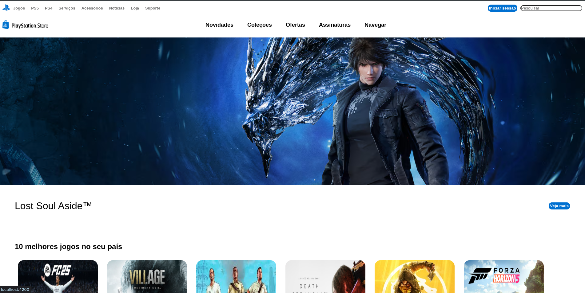

# 🎮 Clone da Página Home da PlayStation Store

Este projeto é um **clone da página inicial da PlayStation Store**, desenvolvido com **Angular**.  
O objetivo foi praticar conceitos fundamentais do framework, incluindo **componentização, diretivas, data binding e estilização com CSS**.

---

## 🚀 Tecnologias Utilizadas

- [Angular](https://angular.io/) - Framework principal
- [TypeScript](https://www.typescriptlang.org/) - Linguagem utilizada
- [HTML5](https://developer.mozilla.org/pt-BR/docs/Web/HTML) - Estrutura da aplicação
- [CSS3](https://developer.mozilla.org/pt-BR/docs/Web/CSS) - Estilização da interface

---

## 📸 Prévia do Projeto

<p align="center">
    
</p>

---

## ⚙️ Como Executar o Projeto

1. Clone este repositório:

   ```bash
   git clone https://github.com/seu-usuario/ps-store-clone.git
   ```

2. Acesse a pasta do projeto:

   ```bash
   cd ps-store-clone
   ```

3. Instale as dependências:

   ```bash
   npm install
   ```

4. Execute o servidor de desenvolvimento:

   ```bash
   ng serve
   ```

5. Abra no navegador:

   ```
   http://localhost:4200/
   ```

---

## 📝 Aprendizados

Durante o desenvolvimento deste projeto, pratiquei:

- Estruturação de um projeto Angular
- Criação e reutilização de componentes
- Uso de **@Input e @Output**
- Estilização de componentes com CSS
- Diretivas estruturais (*ngFor,*ngIf)

---

## 📌 Status do Projeto

✅ Em andamento — ainda pretendo melhorar:

- Responsividade da página
- Organização dos dados em arrays/JSON
- Implementar simulação de API para carregar os jogos

---

## 👨‍💻 Autor

Desenvolvido por **Ally Santana**  
🔗 [LinkedIn](https://www.linkedin.com/) | [Portfólio](https://seu-portfolio.com)
